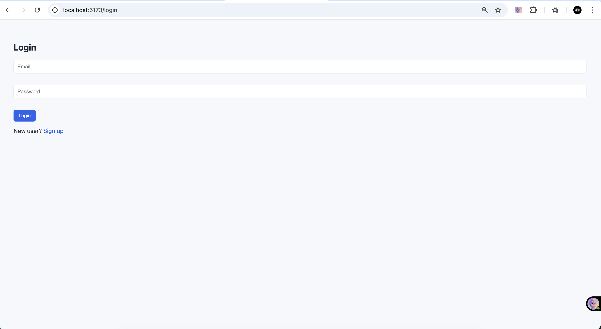
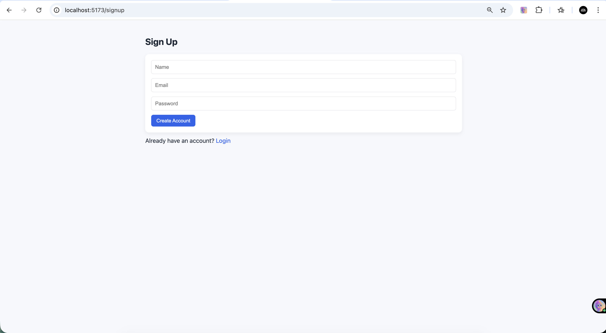
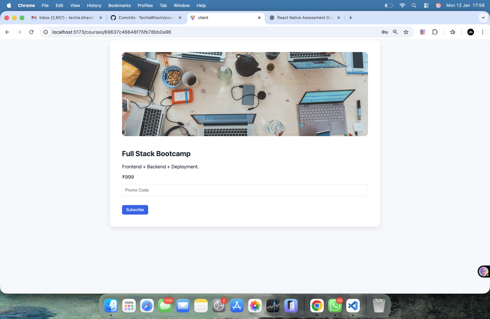
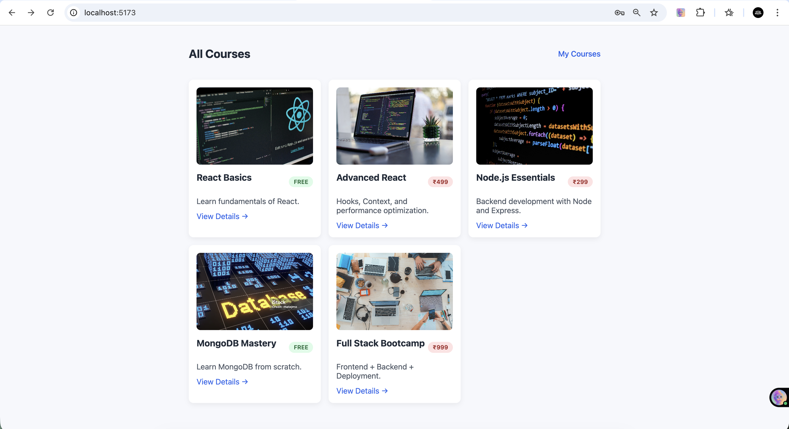

# 📚 Course Subscription App (Black Friday Edition)

A full-stack course subscription application built as part of a technical assessment.
Users can browse courses, login, subscribe to free/paid courses, and view their subscribed courses.

---

## 🚀 Tech Stack

### Frontend
- React (Vite)
- React Router
- Axios
- Basic CSS (no UI library)

### Backend
- Node.js
- Express.js
- MongoDB (Atlas)
- Mongoose
- JWT Authentication

---

## ✨ Features

- User authentication (Login)
- View all courses
- Subscribe to FREE and PAID courses
- Black Friday discount on paid courses (50%)
- Prevent duplicate subscriptions
- View subscribed courses (My Courses)
- Protected routes using JWT
- Clean and responsive UI

---

## 🧪 Test Credentials

Email: bhavin@test.com

Password: 123456


---

## 🛠️ Project Setup

### 1️⃣ Clone Repository
```bash
git clone https://github.com/TechieBhavin/course-subscription-app.git
cd course-subscription-app

---

### Backend setup ## 🛠️ Project Setup
cd server
npm install
npm run dev

server runs on http://localhost:5006

### frontend setup
cd client
npm install
npm run dev

frontend runs on http://localhost:5173

##🔐 API Endpoints (Important)

| Method | Endpoint    | Description            |
| ------ | ----------- | ---------------------- |
| POST   | /login      | User login             |
| GET    | /courses    | Get all courses        |
| POST   | /subscribe  | Subscribe to course    |
| GET    | /my-courses | Get subscribed courses |

##📌 Business Logic Highlights

Free courses can be subscribed without payment

Paid courses apply a 50% Black Friday discount

Backend validation prevents duplicate subscriptions

JWT token required for protected routes

##🧠 Learning Outcome

Full-stack app architecture

Authentication & authorization

API integration with frontend

Error handling & UI state management

Real-world subscription logic

##👨‍💻 Author

Bhavin Patel
GitHub: https://github.com/TechieBhavin

## 📸 Screenshots

### 🔐 Login Page


### 📝 Signup Page


### 📚 All Courses


### 📖 Course Details


### 🎓 My Courses

